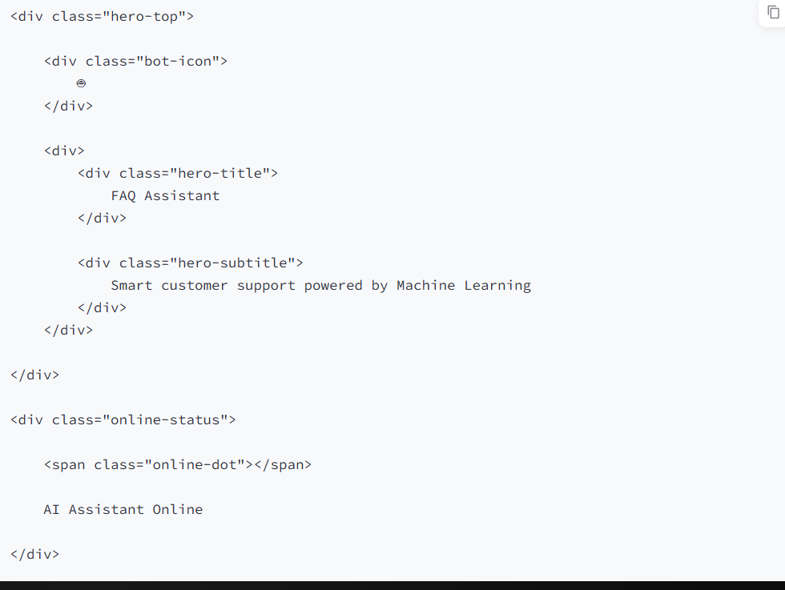
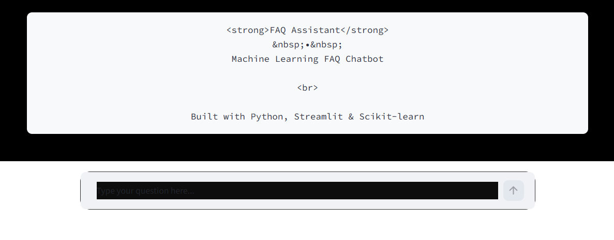
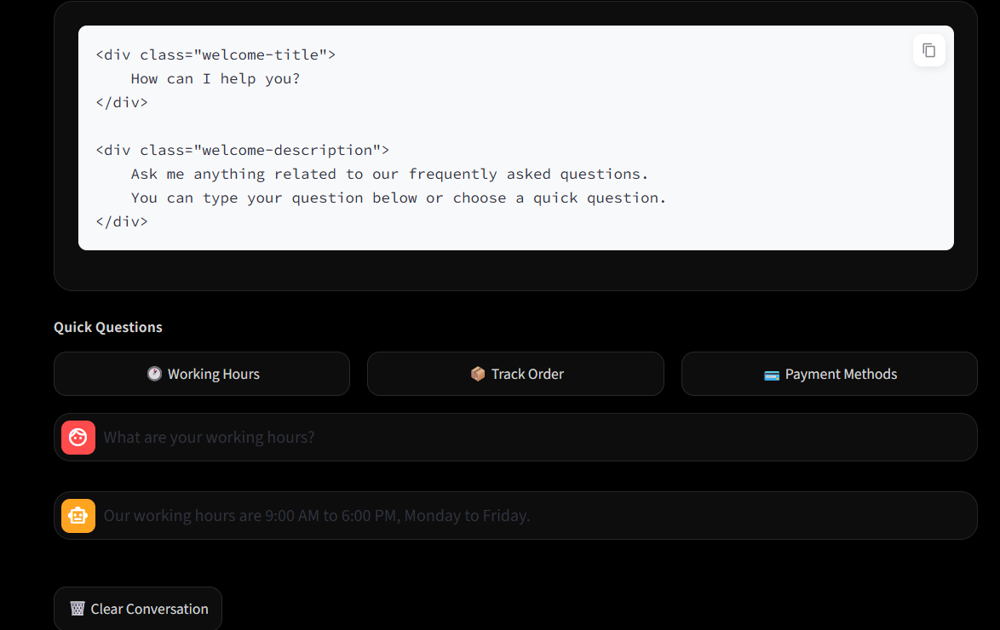

# 🤖 CodeAlpha FAQ Chatbot

A professional and interactive **FAQ Chatbot** built using **Python, Streamlit, and Scikit-learn**.

The chatbot uses **TF-IDF vectorization** and **cosine similarity** to analyze user questions and return the most relevant answer from the available FAQ dataset.

---

## ✨ Features

- 💬 Interactive chatbot interface
- 🔍 Intelligent FAQ matching
- 🧠 TF-IDF based text processing
- 📊 Cosine similarity for question matching
- 🌙 Professional dark/black theme
- ⚡ Fast and lightweight
- 📱 User-friendly Streamlit interface
- 📚 Easy-to-edit FAQ dataset
- 🛡️ MIT Licensed open-source project

---

## 🛠️ Technologies Used

| Technology | Purpose |
|---|---|
| 🐍 Python | Core programming language |
| 🎈 Streamlit | Web-based chatbot interface |
| 🤖 Scikit-learn | TF-IDF and cosine similarity |
| 🔢 NumPy | Numerical operations |
| 🐼 Pandas | Data handling |

---

## 📂 Project Structure

```text
CodeAlpha_FAQChatbot/
│
├── app.py
├── faq_data.py
├── requirements.txt
├── README.md
├── LICENSE
├── .gitignore
│
└── screenshots/
    ├── chatbot.home.png
    ├── chatbot.ques-ans.png
    └── chabot.search.png
```

---

## ⚙️ Installation

### 1. Clone the Repository

```bash
git clone https://github.com/yashika798/CodeAlpha_FAQChatbot.git
```

### 2. Open the Project Folder

```bash
cd CodeAlpha_FAQChatbot
```

### 3. Create a Virtual Environment

```bash
python -m venv .venv
```

### 4. Activate the Virtual Environment

For Windows PowerShell:

```powershell
.venv\Scripts\Activate.ps1
```

### 5. Install Dependencies

```bash
python -m pip install -r requirements.txt
```

---

## 🚀 Run the Chatbot

After activating the virtual environment, run:

```bash
python -m streamlit run app.py
```

Streamlit will provide a local URL, usually:

```text
http://localhost:8501
```

Open the URL in your browser to use the chatbot.

---

## 🧠 How It Works

The chatbot follows these steps:

```text
User Question
      ↓
Text Processing
      ↓
TF-IDF Vectorization
      ↓
Cosine Similarity
      ↓
Find Best FAQ Match
      ↓
Display Answer
```

### TF-IDF Vectorization

The chatbot converts the FAQ questions and the user's question into numerical vectors using **TF-IDF (Term Frequency-Inverse Document Frequency)**.

### Cosine Similarity

The chatbot compares the user's question with the stored FAQ questions using **cosine similarity** and identifies the most relevant question.

The corresponding answer is then displayed to the user.

---

## 📸 Screenshots

### 🏠 Chatbot Home



### 🔍 FAQ Search



### 💬 Question & Answer



---

## 💡 Example Questions

You can ask questions related to the FAQs available in the dataset.

For example:

```text
What are your working hours?
```

```text
How can I contact support?
```

```text
How do I reset my password?
```

The chatbot analyzes the question and returns the closest matching FAQ answer.

---

## 📦 Dependencies

The project uses the following main Python libraries:

- Streamlit
- Scikit-learn
- NumPy
- Pandas

All dependencies are listed in:

```text
requirements.txt
```

Install them using:

```bash
python -m pip install -r requirements.txt
```

---

## 🎯 Project Purpose

This project was developed as part of the **CodeAlpha Internship** to demonstrate practical implementation of:

- Natural Language Processing
- Text Vectorization
- Similarity Matching
- Python Programming
- Streamlit Application Development
- Git and GitHub

---

## 🔮 Future Improvements

Possible future improvements include:

- 🌐 Multi-language support
- 🧠 Advanced NLP models
- 💾 Conversation history
- 🎤 Voice input
- 📈 Chatbot analytics
- 🔄 Dynamic FAQ database
- ☁️ Cloud deployment

---

## 👩‍💻 Author

**Yashika Chaurasia**

GitHub:  
https://github.com/yashika798

---

## 📄 License

This project is licensed under the **MIT License**.

See the [LICENSE](LICENSE) file for details.

---

⭐ If you find this project useful, consider giving it a star on GitHub!
